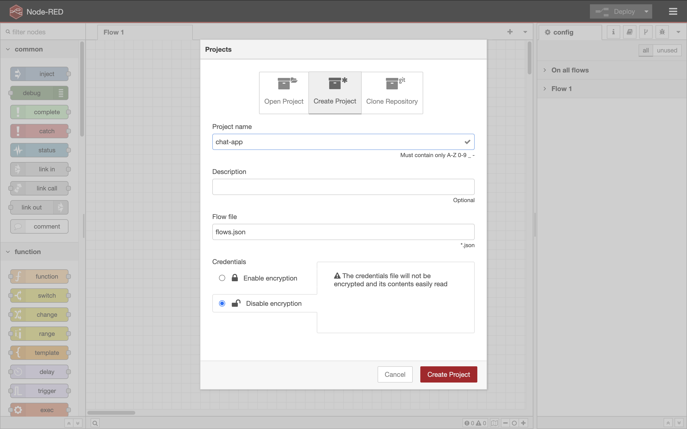
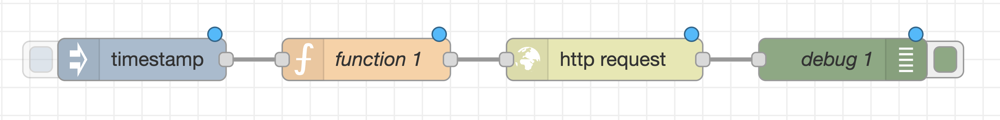

# Chat Application with an Interactive User Interface and a Granite Model

Node-RED can easily connect to state-of-the-art AI technologies, such as the Granite Model. In this tutorial, we will develop a chat application with an interactive user interface and a Granite Model.
<!--
## Installing Ollama (Not required in hands-on)
To use Granite Model with Node-RED, firstly you need to install Ollama, a HTTP server to provide APIs to use AI models. To install Ollama in the Linux environment, input the following command on your terminal.

```
curl -fsSL https://ollama.com/install.sh | sh
```

After the installation process, you can use the `ollama` command in your environment. To download the Granite model into your Ollama, type the `ollama pull command` as flows.

```
ollama pull ibm/granite4.0-preview:tiny
```

In this case, the command will download the Granite 4.0 tiny model. It takes few minutes to download the model file. After the command process is finished, run the `ollama serve` command.

```
ollama serve
```

Now, on your PC, the REST API has been available. This REST API is compatible API of the OpenAI. Therefore, we can use the common way to connect to the REST API.

### Installing Node-RED dashbaord 2.0 (Not required in the hands-on)

To ceate the user interface of the Chat application, Node-RED Dashboard 2.0 is needed. To install Node-RED 2.0, open the "User Settings" from the "Manage Palette" of the top-right menu in the Node-RED flow editor. 

Select "Install" tab, to open the for the node installation. After typing the `@flowfuse/node-red-dashboard` in the search box, the target node item will be filtered on the below list. Click the `install` button of the `@flowfuse/node-red-dashboard` to install the Node-RED dashbaord 2.0 into your Node-RED environment.
After the installation, you can see the dashboard nodes on the left palette of the Node-RED flow editor.
-->
## Creating a Node-RED Flow
First, select "Projects" item on the mebu of the Node-RED flow editor, and then select the "New" to open project dialog.


Create a new project, "chat-app" using the project feature.



After creating the new project, you can then start developing the Node-RED flow for the chat application.

### Creating Node-RED Flow to Access an Ollama Server
To create a simple flow to access the Ollama server, place the inject, function, http request and debug nodes with wires as shown below.



Double-click the inject node to open the node property UI. To set the prompt for the Ollama server, click the time icon next to "millisecounds since epoch" to open the data type dropdown menu. For the data type of `msg.payload`, select `string` from the menu. Then, type the string message, "What is IBM? Describe it in 10 words." in the text input box next to the `az` icon.


In the function node, enter "post data" to the name field and then paste the following code to set the POST message for the Ollama server.

```
msg.payload = {
    "messages": [
        {
            "role": "user",
            "content": msg.payload
        }
    ],
    "model": "ibm/granite4.0-preview:tiny"
};
return msg;
```


For the http request node, select or input the following settings on the node property UI.
- Method: POST
- URL:
  ```
  http://localhost:11434/v1/chat/completions
  ```
- Return: a parsed JSON object


The debug node's node property settings are the default settings. After clicking the deploy button, you can access the Ollama server by clicking the inject node's left button.


Expand the received message in the debug tab to check the response from the Ollama server. The answer will be in the JSON path of `payload.choices[0].message.content`.

## Creating a Simple Chat UI
The Node-RED dashboard supports the Vuetify UI in the template node. In this material, we use the timeline UI provided by Vuetify to show Chat UI.
To create the chat UI, place a text input node, a function node, and a green template node in the Dashboard 2.0 category. Connect them with wires as shown below.


In the property UI of the text input node, uncheck the "Focus leave" checkbox because the chat UI unintentionally sends to a request to the Ollama server for an answer when switching between the dashboard UI page and the  Node-RED flow editor page.


The function node name was changed to "user comment" to distinguish it from other function nodes that will be created later. In the function node, paste the following code.

```
var tmp = flow.get('data') || [];
tmp.push(
    {
        image: "https://nodered.jp/images/yokoi.jpg",
        message: msg.payload
    }
);
flow.set('data', tmp);
msg.payload = tmp;
return msg;
```


In the template node, replace the existing code with the following code to display the chat UI using Vuetify.

```
<template>
  <v-timeline class="overflow-y-auto" style="max-height:400px">
    <v-timeline-item v-for="item in msg.payload">
      <template v-slot:icon>
        <v-avatar v-bind:image="item.image"></v-avatar>
      </template>
      <v-alert>{{item.message}}</v-alert>
    </v-timeline-item>
  </v-timeline>
</template>
```

Additionally, on the template node property UI, the group should be changed to "[Page 1] Group 1" because the default selection is "none".


To display the chat UI on the Node-RED Dashboard 2.0, click the deploy button and then select the "Dashboard 2.0" tab in the right sidebar. Then, click the "Open Dashboard" button in the top right corner.


The dashboard will have the following Chat UI, which supports text input and a history timeline.


To clear the chat history managed by the flow context internally, you need to clear it manually. Open the "context" tab in the right sidebar, and click the "refresh" button to get the latest data. Then, click the "Delete" button.


From the next input on the chat UI, the timeline will be cleared on the dashbaord.

## Integrating the Chat UI with the Ollama flow
To integrate the two flows that we created, connect the text input node to the function node which has "post data" as the node name. 


Insert a new function node between the http request node and the template node to handle the retrieved data. In the function node, enter "ai comment" in the name field, and then paste the following code.

```
var tmp = flow.get('data') || [];
tmp.push({image: "https://2.bp.blogspot.com/-H2eLSLfzvpA/XGjx1UapC6I/AAAAAAABRcA/5Xdh-W7tqk8X1YONndv2B1ykhJ6BRS1bgCLcBGAs/s800/ai_computer_sousa_robot.png", message: msg.payload.choices[0].message.content});
flow.set('data', tmp);
msg.payload = tmp;
return msg;
```


This code extracts the answer from the AI and sets it for the Chat UI. After clicking the deploy button, you can use the chat UI on the dashboard.


