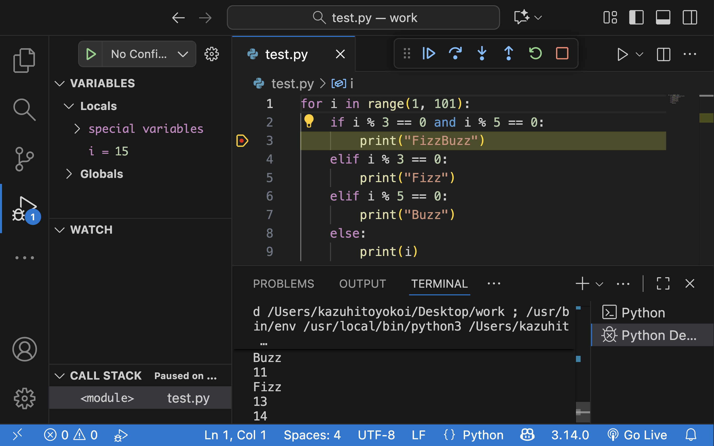
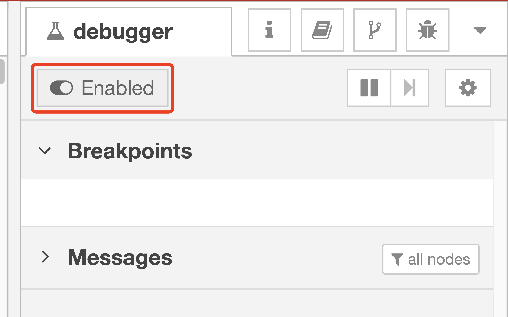
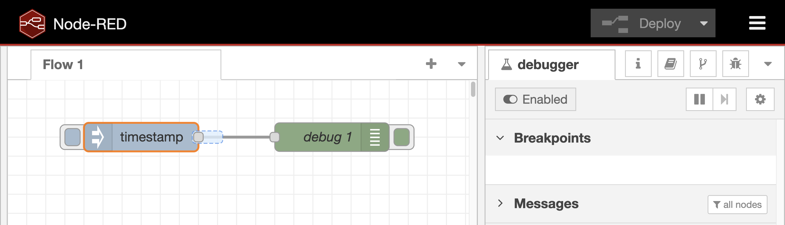
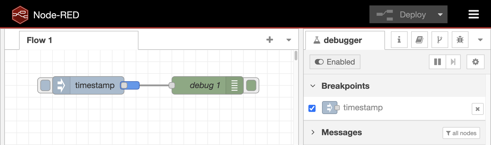
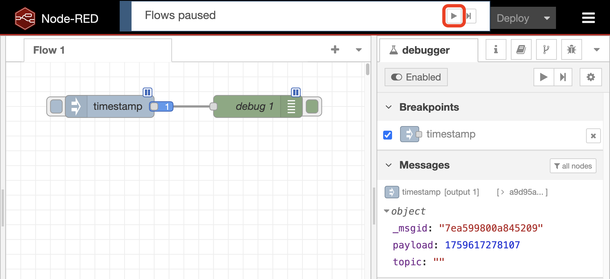
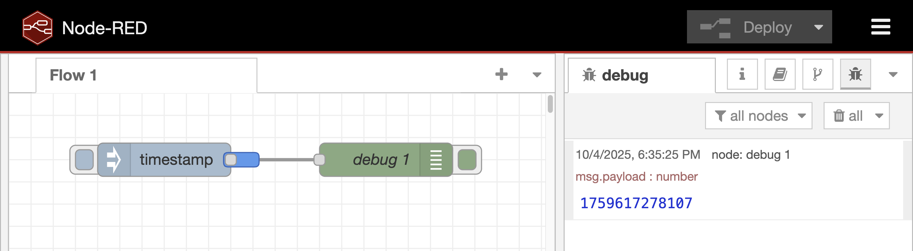

# Flow Debugger
A code debugger is a common tool for general programming languages. When using Visual Studio Code for Python programming, breakpoints are set in lines of code. And then, we can investigate the variables at these breakpoints while the code executes.

The Flow Debugger provides the same developer experience for the Node-RED flow editor. This tutorial explains how to use the flow debugger.

## Enabling the Flow Debugger
By default after installation of the flow debugger, the Flow Debugger is disabled in the flow editor. To activate the Flow Debugger, developers need to open the debugger tab in the right sidebar and then turn on the debugger by clicking the switch marked "Enabled".

## Setting a breakpoint
After enabling the Flow Debugger, you can set breakpoints on the ports of the nodes in the flow. Once the mouse pointer hovers over a port, a dotted light bule box will appear.

Clicking the dotted light blue box will add the blue breakpoint to the port. Afterwards, you can view the assigned breakpoints in the debugger tab.

## Stopping flow
Once you start the flow, the flow execution will stop at the breakpoint. Then, you can observe the value of the msg.payload in the debugger tab.

If you want to restart the flow execution from the breakpoint, click the "Resume flows" button.

Alternatively, you can click the "Step flows" button next to the "Resume flows".
Without manually adding breakpoints at every ports, you can observe each message in the virtual breakpoints by clicking "Resume flows" button.
Using the "Resume flows" button, the Flow Debugger copies the situation by adding breakpoints to all of the ports after the actual breakpoint.

# Conclusion
This tutorial explained how to use the Flow Debugger. Without the Flow Debugger, developers tend to use the debug node to check the `msg.payload` data. However, using the debug node requires changing the flow. Therefore, undoing and redoing can be a bit troublesome. In terms of the Git version history, committing the placement of a debug node in the flow is unrelated to the flow logic. With the flow debugger, developers can check the message payload without changing the flow.

The Flow Debugger is a powerful tool for fixing problems in your flow. Instead of adding and removing debug nodes, you can use breakpoints to pause the flow at any port. This lets you check message data directly without changing your flow, allowing for a much faster and cleaner debugging process.
