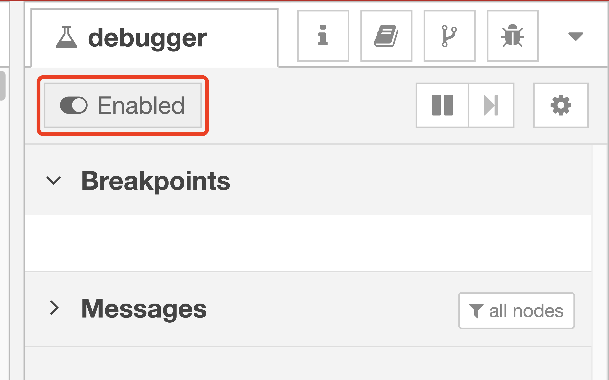

# Using debugger
Code debugger is also common tool in general programing languages. When we use Visual Studio Code in Python programming, we set the break points in the line of code. We can investigate the variables at the break points while executing code.
Flow debugger provides the same developer expriences on Node-RED flow editor. This tutorial explains the steps to use the flow debugger.

## Enabling debugger
As the default, flow debugger is disabled in flow editor. Therefore, developer need to open the debugger tab on the right side bar and turn on the debugger by clicking the switch.

## Setting breakpoint
After enabling the flow debugger, you can add the break points on the ports of the nodes. Once mouse pointer cover the port, you can see the shadow of the break point.

After clicking the shadow, the break point is successfully added to the port. You can see the assigned breakpoints on the debugger tab.

## Stopping flow
Once start 

# Conclusion
