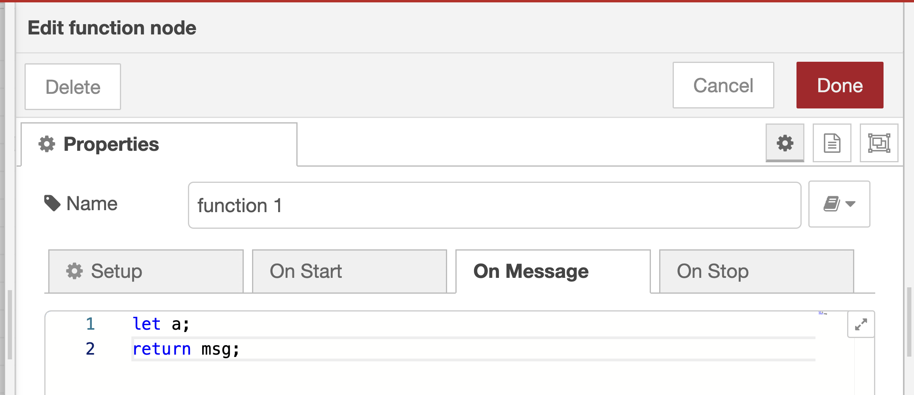
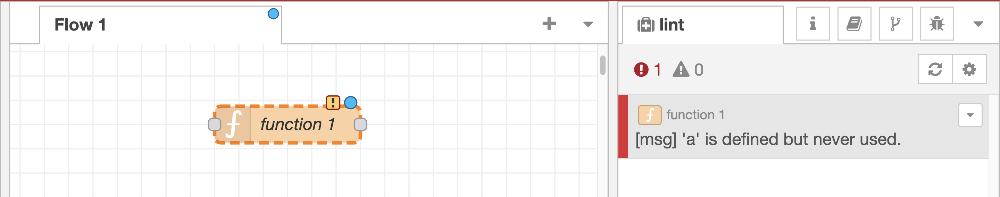
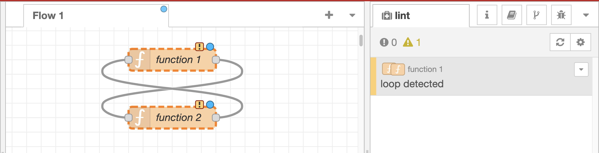
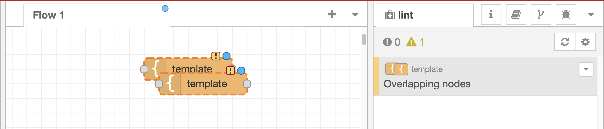
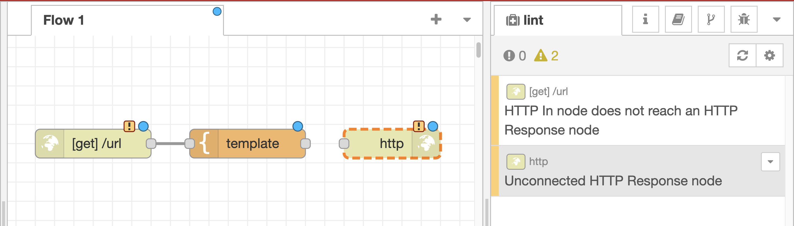
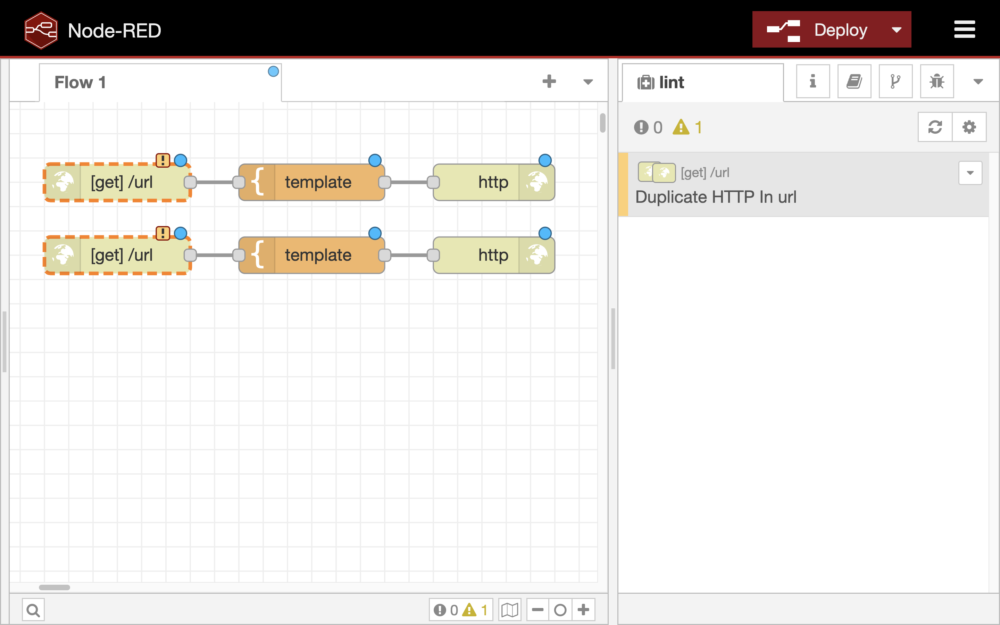

# Flow Linter
Code linter is common tool in the programing to check potential errors in the code. For example, we use ESLint in JavaScript programming and flake8 in Python programming. Node-RED project also provide flow linter which is same idea as the code linter. Because Node-RED is visual programming tool, the flow linter has error sugesstion on not only JavaScirpt code of function node but also flow based programming. In this material, we will focus on the both linter rules.

# Linter rules
## function-eslint
To observe the behaivor of flow linter in funciton node, place the function node and write the following code on the node property of the function node.

```
let a;
return msg;
```



In this code, variable `a` is node used. Therfore, after closing the node property UI, there is a warning on the linter tab of the side bar.



## no-loops
In flow-based development, developers sometimes creating loop of the flow. It is the same situation as infinity loop in the general programming languages. To avoid this situation, flow linter notify the warning of the looping flow. For example, when there are two function node which makes loop, the linter tab has warning message, "loop detected".



## no-overlapping-nodes
There is another issue in flow-based development. When develpers put the nodes in the workspace, they put one node on the another node. In this case, we cannot see the node behind the other node. For this situation, flow linter shows the warning message, "Overlapping nodes" on the linter tab. 



## no-unconnected-http-nodes
In the Node-RED flow editor, the pair of http-in node and http response node is used to define the HTTP endpoint. If the only http-in node is used in the flow, the HTTP client cannnot recieved the response of the HTTP request. To notify the lack of pair, linter tab has the following messages.



## no-duplicate-http-in-urls
In the one Node-RED environment, more than two REST APIs which has the same endpoints. If developer defines the same endpoint such as "/api" in the two http-in node, linter tab has alert message.



## Conclusion
Node-RED is visual programming tool to realize easy development. On the other hand, there are unexpected issues related to visual programming. The flow linter is one of the tool to solve the aspect.
