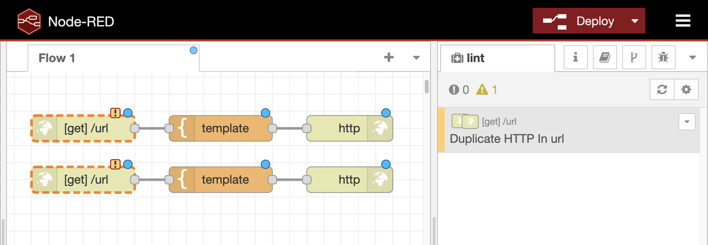

# Flow Linter
A code linter is a common feature in the programming to check for potential errors in the code. For example, we use ESLint for JavaScript and Flake8 for Python. The Node-RED project also provides Flow Linter, which is same idea as the code linters. Since Node-RED is visual programming tool, Flow Linter provides error sugesstions not only for JavaScript code in function nodes but also for flow-based programming. In this material, we will focus on the both linter rules.

# Linter Rules
## function-eslint
To observe Flow Linter's behaivors in a funciton node, place a function node and write the following code in the node property of the function node.

```
let a;
return msg;
```


In this code, the variable `a` is node used. Therefore, after closing the node property UI, a warning will appear on the linter tab in the sidebar.


## no-loops
In flow-based development, developers sometimes create loops in the flow. This is similar to an infinite loop in the general programming languages. To avoid this situation, the Flow Linter notifies developers of looping flows. For example, if two function nodes create a loop, the Flow Linter tab displays a warning message, "loop detected".


## no-overlapping-nodes
There is another issue in flow-based development. When developers place the nodes in the workspace, they sometimes put one node on the another node. In this case, the node behind the other node is not visible. The Flow Linter shows a warning message, "Overlapping nodes" on the linter tab in this situation.


## no-unconnected-http-nodes
In the Node-RED flow editor, a pair of http-in and http response nodes is used to define an HTTP endpoint. If only an http-in node is used in the flow, the HTTP client cannnot receive the response from the HTTP request. To notify the missing pair, the linter tab displays the following messages.


## no-duplicate-http-in-urls
In the one Node-RED environment, developers cannot define more than two REST APIs with the same endpoints. If developer defines the same endpoint such as "/api" in the two http-in nodes, the linter tab displays an alert message.



## Conclusion
Node-RED is visual programming tool that simplifies development. However, unexpected issues related to visual programming may arise. The Flow Linter is one of the tool that solves these issues.
