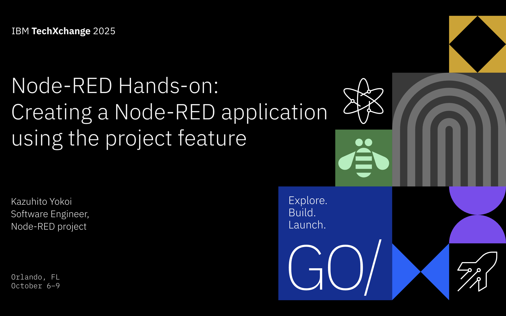

---
# Kazuhito Yokoi
- Core contributor of Node-RED project
- Organizer of Node-RED User Group
- Member of LF AI & Data Foundation Community

https://openjsf.org/blog/node-red-unleashed


---
## What is Node-RED?
Low-code development tool from novice users to IT professionals

- Released by IBM as an open source software
- Hosted by the OpenJS Foundation
- Used in manufacturing industry to realize industrial IoT


---
# Node-RED statistics
Node-RED has been widely used for 10 years.
- 155 releases
- 9,802 commits
- 237 contributors
- 22k GitHub stars
- 3B+ Docker pulls
- 5,562 community nodes
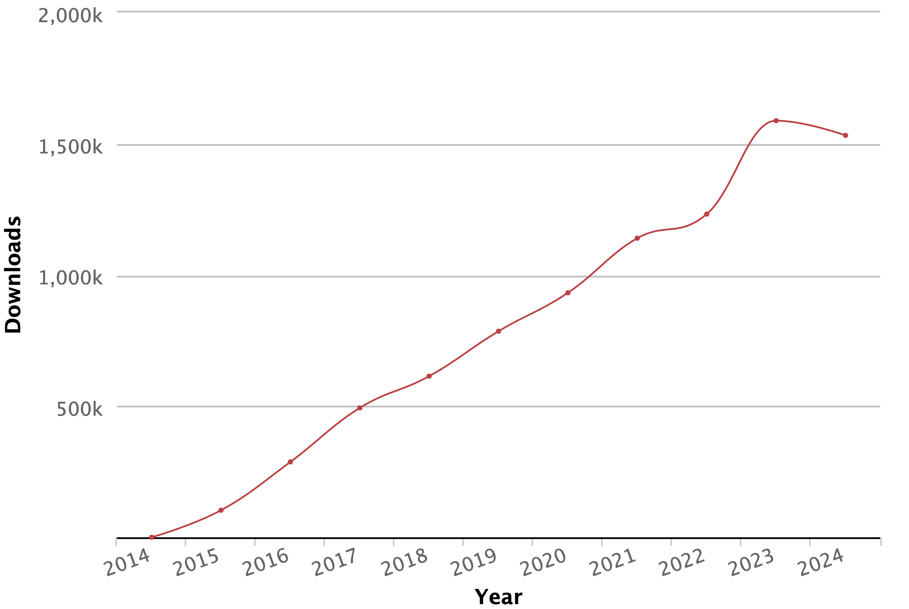

---
# Supported Envionments
Node-RED supports environments that can run Node.js.
- Local PC
  - Windows
  - macOS
  - Ubuntu
- Docker
- Raspberry Pi
- Cloud
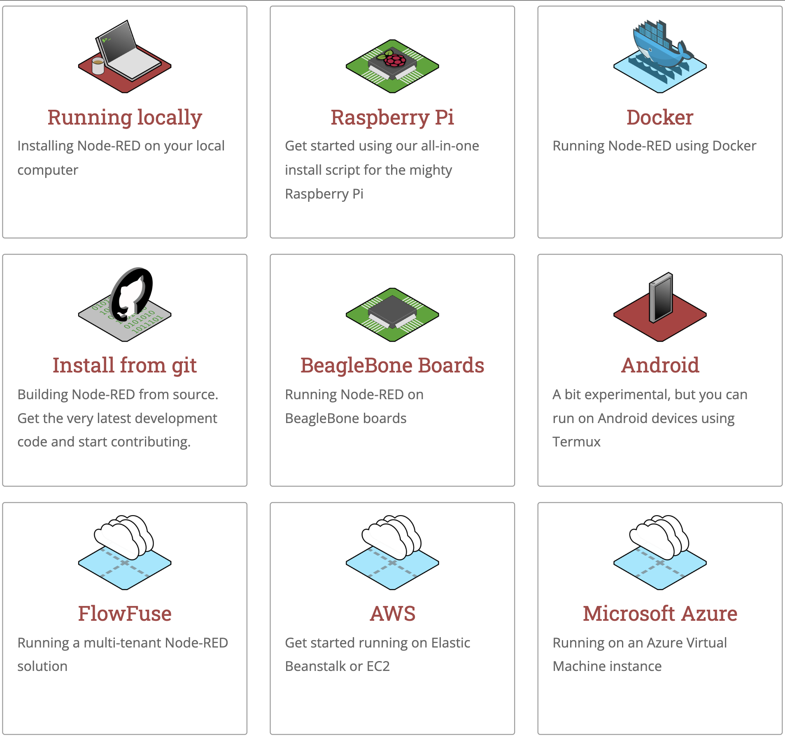

---
# How to install
- Local environment
```
sudo npm install -g --unsafe-perm node-red
node-red
```
- Docker
```
docker run -it -p 1880:1880 --name
mynodered nodered/node-red
```
- Raspberry Pi
```
bash <(curl -sL
https://raw.githubusercontent.com/node-red/linuxinstallers/master/deb/update-nodejs-and-nodered)
```
---
# Node-RED nodes
Many predefined and custom connectors for services and devices
- Data collection
- Machine control
- External server access
- Database connection
- Data analysis
- Visualization

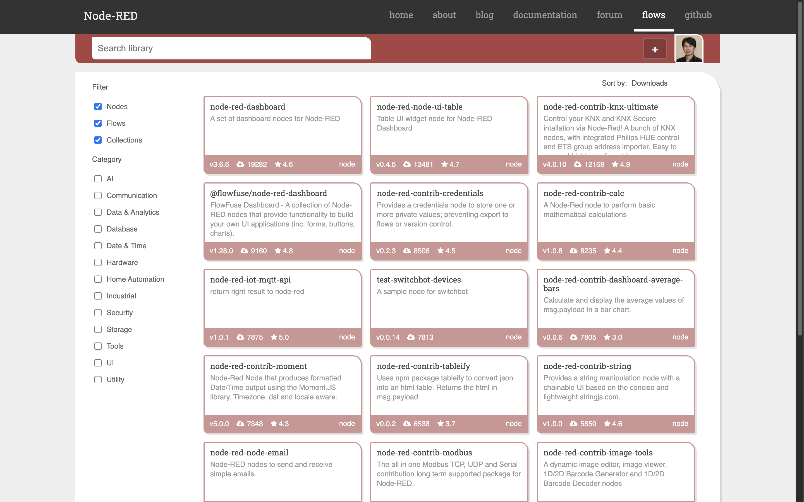

---
# Pre-installed Devices
Many devices equip Node-RED as a pre-installed software.
- Seeed Studio, reTerminal DM, reCamera
- Advantech, ADAM-6700
- ADLINK, Vizi-AI Devkit
- QNAP, QIoT Suite
- Emerson, PACEdge

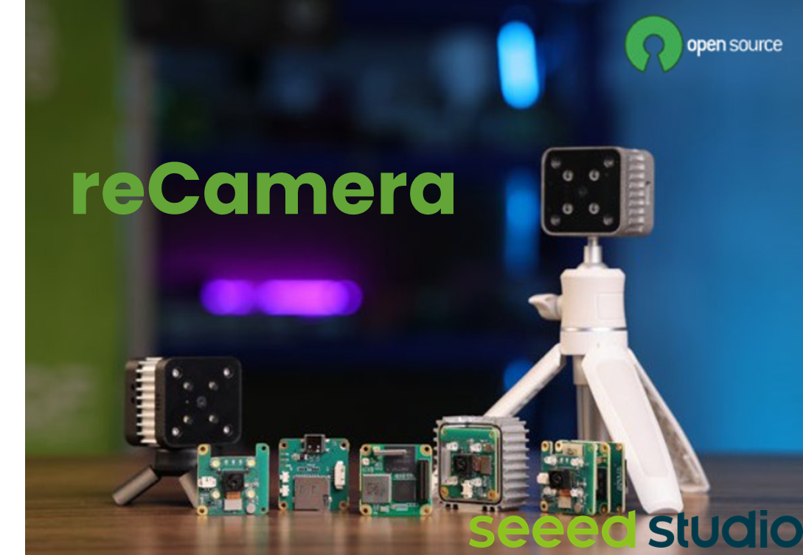

---
# GAIA-X Federation Services
OSS set for data exchange between companies
- Hosted by the Eclipse Foundation from 2023
- GXFS Workflow Engine based on Node-RED

https://github.com/eclipse-xfsc/orchestration-engine

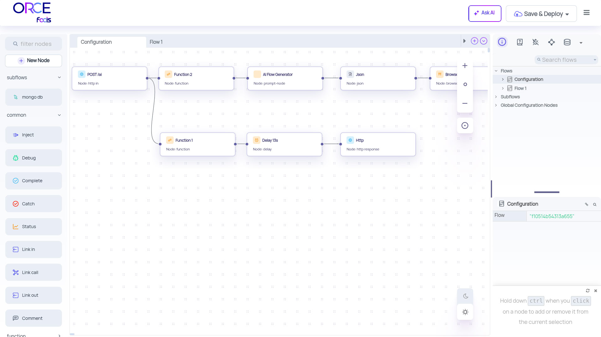

---
# Opera Browser
Opera Software adopted Node-RED for their browser, Opera GX for smart home use cases
  - Getting your room ready for watching movies
  - Syncing the colors of smart bulbs with the theme of Opera GX

https://github.com/operasoftware/opera-smart-home

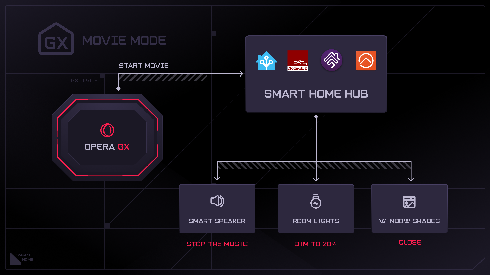

---
## Advanced features
Features to improve developer experiences
- Project feature (Git functionality)
  - Managing flows
  - Tracking changes
- Flow Linter
- Flow Debugger

---
# Issues without project feature
We encounter the following issues in default setting.

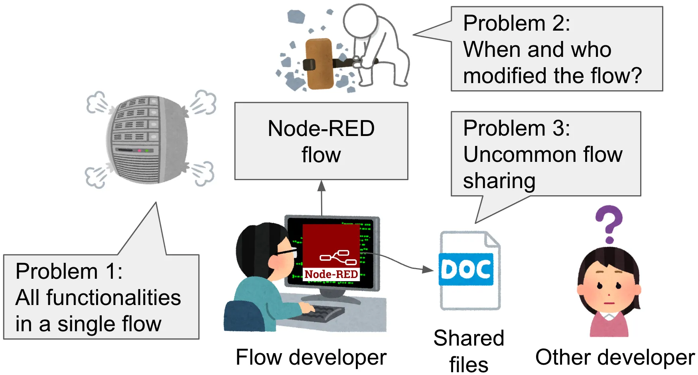

---
# Solution with project feature
Project feature solves the previous issues.

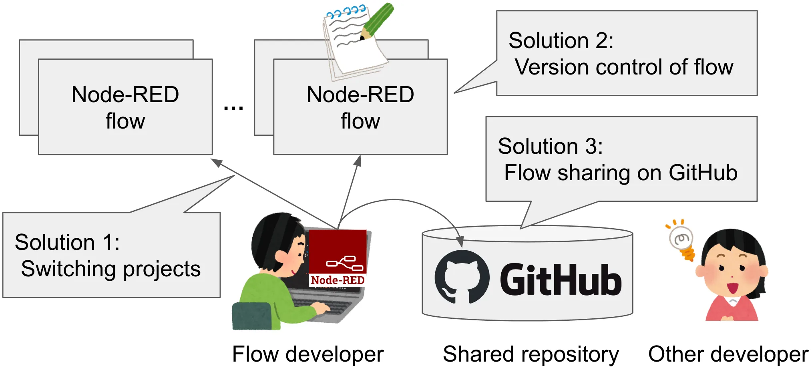

---
# Flow Linter
Provides real-time feedback same as code linter

- Supprted potential issues:
  - http-in node without http-response node
  - Looping flows
  - Overlapping nodes
  - Unset node names
- Custom rules:
  - Recommendation of English node names

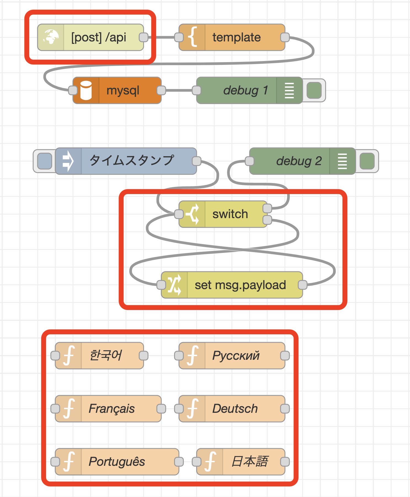

---
# Flow Debugger
Provides same user experience as code debugger
- Creating breakpoints 
- Pausing flows
- Inspecting messages
- Step by step execution

<!-- TODO: injectとdebugでフローデバッガ設定の画面 -->


---
# Conclusion
- We learned the advanced features of Node-RED
  - Project feature 
  - Flow linter
  - Flow debugger
- Development example of Chat UI application

-> I believe that you will develop the great flows using these features and example.

---
# Node-RED Conference 2025
- Date: Tuesday, November 4, 2025
- Location: Online
- Speakers: Intel, FlowFuse, Victron Energy, Fluidy Financial Services, City of Morro Bay / GCIS and more
- Registration: Free
https://nrcon.nodered.org/

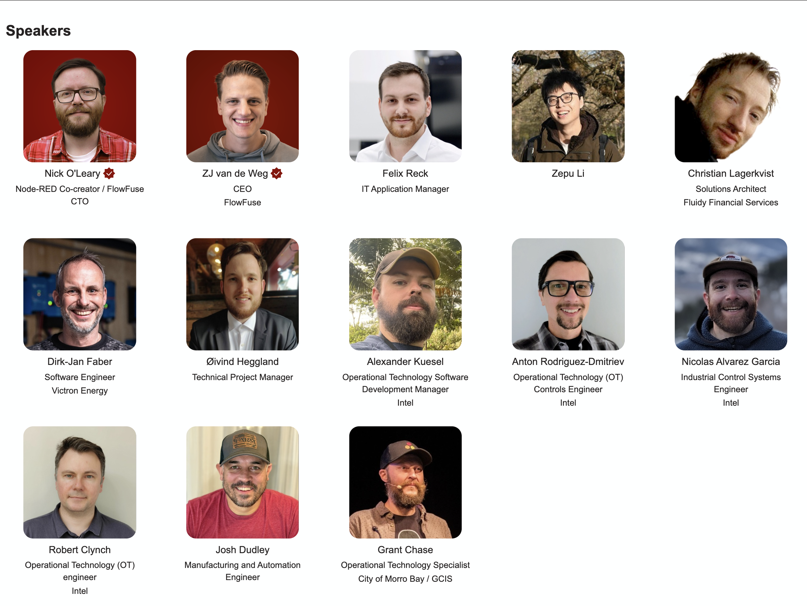

---
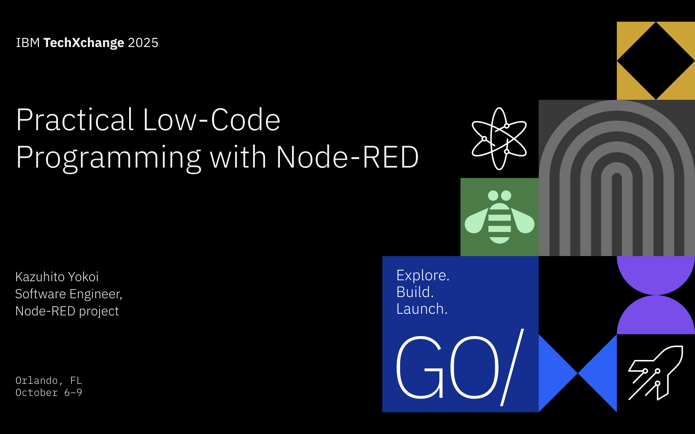

---
## Setup Node-RED environment on GitHub codespaces

## Simple demonstration

---
# Chat application with an interactive user interface and a Granite model

To realize modern factory systems, Node-RED can easily connect to the devices in the factory and state-of-the-art AI such as Granite Model. 