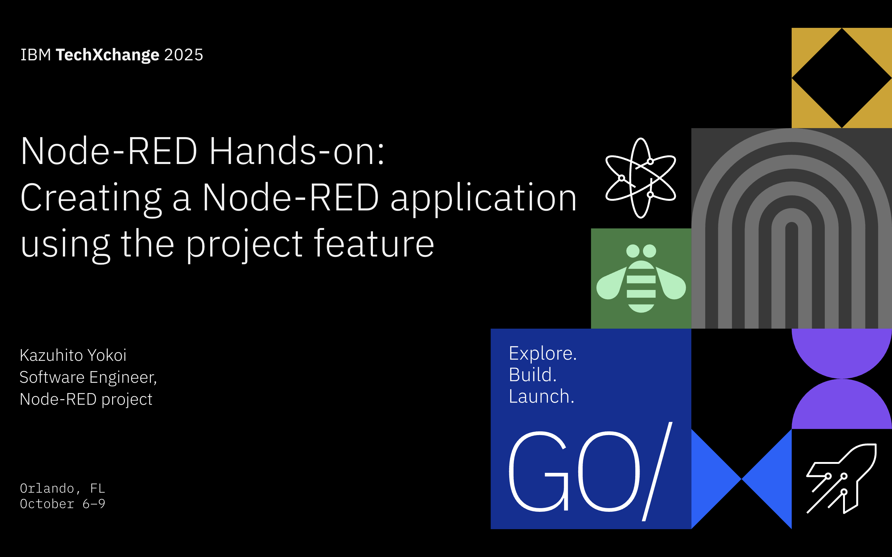
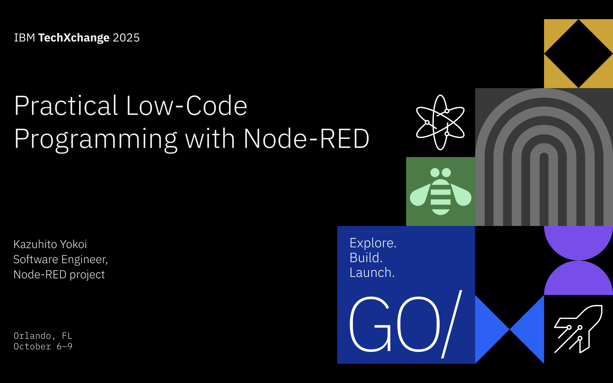
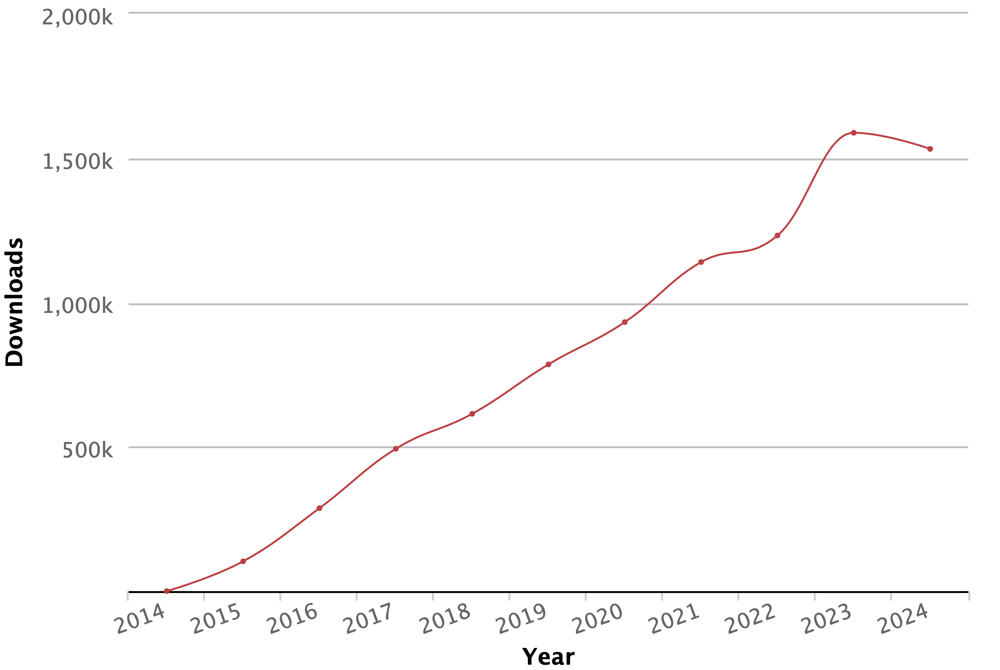
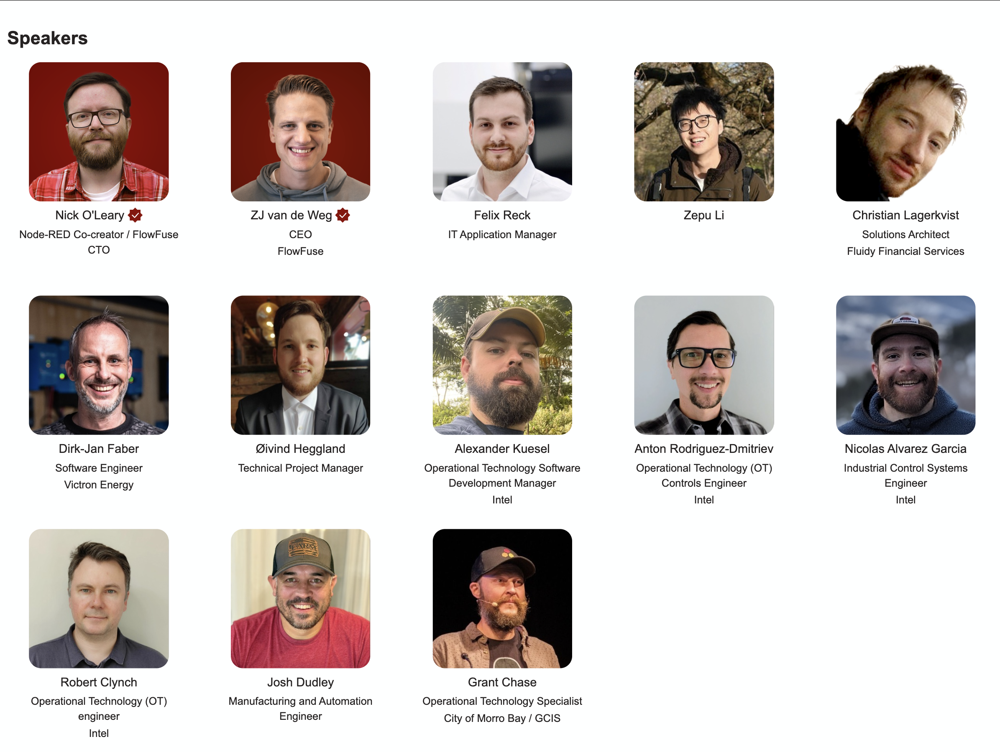

---

---

# Self-introduction
- Kazuhito Yokoi
- Core contributor of Node-RED project
- Organizer of Node-RED User Group
- Member of LF AI & Data Foundation Community

---
## What is Node-RED?
Node-RED is a low-code development tool
- Released by IBM as an open source software
- Hosted by the OpenJS Foundation

---
# Node-RED statistics
- 155 releases
- 9802 commits
- 237 contributors
- 22k GitHub stars
- 5562 community nodes
- 1M monthly Docker pulls
- 100k monthly NPM downloads

---
# 
This tool is easy to use for novice users and it is also a powerful tool for IT professionals. 
It has become a common tool in the manufacturing industry to create intelligent IoT solutions using flow-based development with low-code. 

---
## Setup Node-RED environment on GitHub codespaces

## Simple demonstration

## Advanced feature
- Git version control
- Linting
- Debugging

---
# Git version control
- managing flows
- tracking changes

---
# Flow Linter
Provides real-time feedback same as code linter

- Supprted potential issues:
  - Overlapping nodes
  - Looping flows
  - Unset node names
  - http-in node without http-response node

---
# Flow Debugger
Provides same user experience as code debugger
- Creating breakpoints 
- Pausing flows
- Inspecting messages
- Step by step execution

---
# Chat application with an interactive user interface and a Granite model

To realize modern factory systems, Node-RED can easily connect to the devices in the factory and state-of-the-art AI such as Granite Model. 

---
# Conclusion

---
# Node-RED Conference 2025
- Date: Tuesday, November 4, 2025
- Location: Online
- Speakers: Intel, FlowFuse, Victron Energy, Fluidy Financial Services, City of Morro Bay / GCIS and more
- Registration: Free
https://nrcon.nodered.org/

